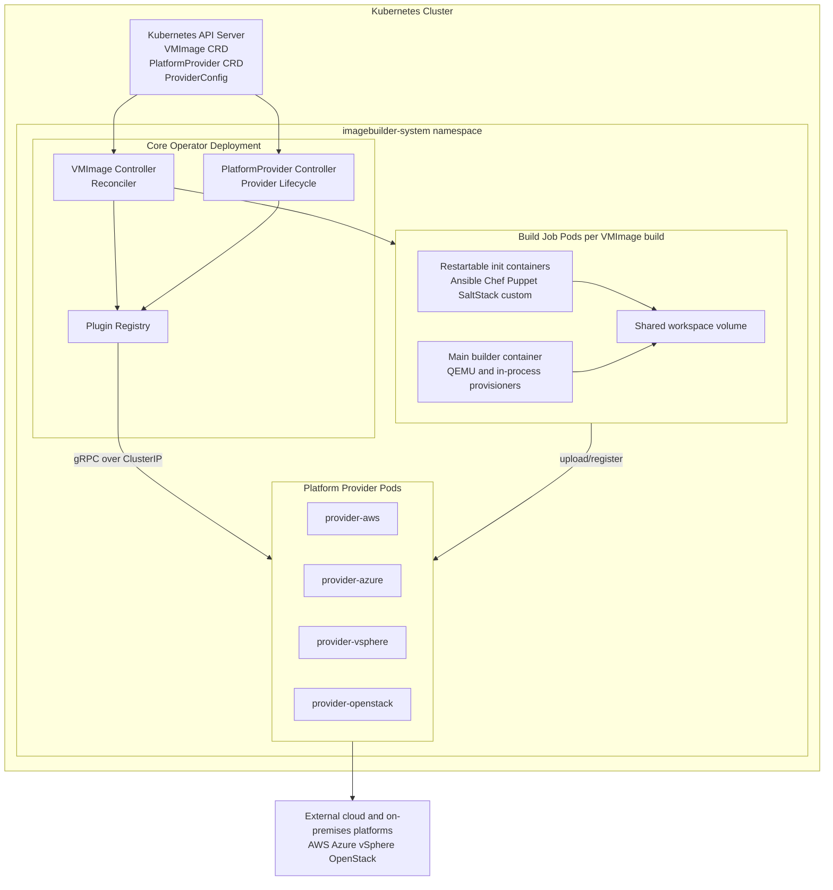

# System Architecture Description — VM Image Builder

## Document Control

| Field | Value |
|---|---|
| Document ID | ARCH-001 |
| Version | 1.0.0 |
| Status | Draft |
| Date | 2026-04-18 |
| Author | Platform Engineering |
| Classification | Internal |
| Review Cycle | Per release or major architectural change |

---

## Table of Contents

1. [System Overview](#1-system-overview)
2. [Architectural Principles](#2-architectural-principles)
3. [Component Architecture](#3-component-architecture)
4. [Data Flow](#4-data-flow)
5. [CRD Data Model](#5-crd-data-model)
6. [Plugin System](#6-plugin-system)
7. [Provisioner System](#7-provisioner-system)
8. [Security Architecture](#8-security-architecture)
9. [Deployment Architecture](#9-deployment-architecture)
10. [Technology Stack](#10-technology-stack)
11. [Interface Contracts](#11-interface-contracts)
12. [Implementation Status](#12-implementation-status)
13. [Traceability Summary](#13-traceability-summary)

---

## 1. System Overview

### 1.1 Purpose

The **VM Image Builder** is a Kubernetes-native operator that enables automated, declarative
construction of virtual machine (VM) disk images for multiple cloud and on-premises
infrastructure platforms.

The system builds, customises, and publishes VM images as a Kubernetes Operator
and is released exclusively under the **Apache License 2.0**, making it suitable
for commercial redistribution without license restrictions.

### 1.2 Problem Statement

Organisations operating multi-cloud or hybrid environments need a unified mechanism to
build consistent, hardened VM base images across platforms such as AWS, Azure,
VMware vSphere, and OpenStack while keeping image definitions Kubernetes-native.

### 1.3 System Boundaries

**In Scope:**
- Receiving and validating `VMImage` Custom Resource Definitions (CRDs)
- Orchestrating VM image builds using QEMU/libvirt and diskimage-builder backends
- Executing provisioners (cloud-init, Ansible, shell, PowerShell, custom)
- Uploading and registering built images to target platforms (AWS, Azure, GCP, vSphere, OpenStack)
- Managing platform provider lifecycle via `PlatformProvider` CRDs
- Storing build status and results in Kubernetes resource status

**Out of Scope:**
- Provisioning or deploying VM instances from built images (this is a separate concern)
- Image vulnerability scanning (intended to be a downstream provisioner step)
- Long-term image storage management (delegated to the target platform)

### 1.4 Stakeholders

| Stakeholder | Role | Concern |
|---|---|---|
| Platform Engineering | Owner | Architecture, implementation, release |
| DevOps / SRE Teams | Consumer | Building and consuming VM images |
| Security Team | Reviewer | License compliance, secret management, supply chain |
| ISAE Auditor | External | Control objectives, documentation completeness |

---

## 2. Architectural Principles

The following principles govern all architectural decisions in this system.
Each principle is referenced by one or more Architecture Decision Records (ADRs).

| # | Principle | Rationale | ADR |
|---|---|---|---|
| P-01 | **Apache 2.0 First** — All statically linked dependencies must be Apache 2.0 or MIT licensed. | Legal requirement for redistribution. | ADR-001, ADR-004 |
| P-02 | **Kubernetes-Native** — The operator uses Kubernetes primitives (CRDs, Jobs, Init Containers, RBAC) rather than custom scheduling or orchestration. | Reduced operational complexity; leverages existing cluster infrastructure. | ADR-003 |
| P-03 | **Process Boundary = License Boundary** — LGPL-licensed tools are accessed only as external processes, never as linked libraries. | Preserves Apache 2.0 redistribution rights. | ADR-004 |
| P-04 | **Declarative Configuration** — Users define desired image state; the operator is responsible for achieving it. | Kubernetes reconciliation model; self-healing on failure. | — |
| P-05 | **Extensibility Without Core Changes** — New platform providers and provisioners can be added without modifying the core operator. | Enables community contributions and proprietary extensions. | ADR-002, ADR-003, ADR-006 |
| P-06 | **Stable Contracts** — The gRPC provider interface (protobuf) is versioned and backward-compatible. Breaking changes require a new API version. | Decouples provider release cycle from operator release cycle. | ADR-005 |
| P-07 | **Static Binaries** — `CGO_ENABLED=0`; no runtime C library dependencies in operator containers. | Simplified container images, reproducible builds, no linking-related license issues. | ADR-004, ADR-006 |
| P-08 | **Least Privilege** — Operator and provider pods operate with the minimum required Kubernetes RBAC permissions. | Defense in depth. | REQ-004 |

---

## 3. Component Architecture

### 3.1 High-Level Component Diagram



### 3.2 Component Descriptions

#### 3.2.1 Core Operator

The central control plane component. Runs as a Kubernetes Deployment (≥ 2 replicas for HA)
with leader election.

**Responsibilities:**
- Watch and reconcile `VMImage`, `PlatformProvider`, and `ProviderConfig` CRDs
- Orchestrate build Job creation and monitor progress
- Manage platform provider pod lifecycle
- Maintain the plugin registry of healthy providers
- Expose metrics (`:8080`) and health probes (`:8081`)

**Key packages:**
- `pkg/controller/vmimage/` — VMImage reconciler
- `pkg/controller/provider/` — PlatformProvider lifecycle controller
- `pkg/controller/buildpod/` — Build Job and init-container assembly
- `pkg/plugin/registry.go` — In-memory provider registry

#### 3.2.2 Platform Provider Pods

Separate Kubernetes Pods (one per `PlatformProvider` CRD) implementing the gRPC provider
interface. Managed by the core operator as Kubernetes Deployments.

**Responsibilities:**
- Implement the 6 gRPC methods defined in `api/provider/v1/provider.proto`
- Upload disk image artifacts to the target platform
- Register the uploaded artifact as a platform-native image (AMI, OVA, etc.)
- Report capabilities and health status

**Built-in providers** (compile-time, blank import):
`plugins/aws`, `plugins/azure`, `plugins/gcp`, `plugins/openstack`, `plugins/vsphere`

**Community providers**: Any OCI image implementing the protobuf interface.

#### 3.2.3 Build Job Pods

Kubernetes Jobs created per VMImage build. Use restartable init containers for
complex provisioner tool isolation while the builder coordinates sequential
execution.

**Responsibilities:**
- Execute the build backend (QEMU, diskimage-builder, or cloud API)
- Run provisioners sequentially through builder coordination and init-container isolation
- Write build artifacts to the shared `/workspace` volume
- Upload artifacts to target platforms via the platform provider (or directly via SDK)

#### 3.2.4 Plugin Registry

In-memory registry within the core operator process. Maintains the set of currently
healthy and registered platform providers. Used by the VMImage controller to look up
providers by name when processing targets.

---

## 4. Data Flow

### 4.1 VMImage Build — End-to-End Flow

```
1. User applies VMImage manifest
       kubectl apply -f vmimage.yaml

2. Kubernetes API Server validates the CRD schema and persists the resource

  Updates are revision-controlled: active build specs are immutable, while a
  terminal spec update must change `spec.build.revision`.

3. VMImage Controller detects the new resource (WATCH event)

4. Controller validates the spec:
   - Source image URL and checksum format
   - Provisioner types are either registered in-process types or init-container types with a default/custom OCI image
   - All referenced ProviderConfigs exist
   - All referenced providers are in Healthy state

5. Controller sets status.phase = Building and emits a Kubernetes Event

6. Controller creates a Kubernetes Job with:
   - Init containers for each provisioner
  - Main builder container
  - A PVC-backed `/workspace` when a separate upload Job is required
   - Optional PVC volume /cache when spec.build.cache.ref is configured
  - No platform credentials in the builder container

7. Build Engine (QEMU/diskimage-builder/SDK):
   - Reuses a verified checksum-addressed source cache entry when present
   - Downloads and verifies source image (checksum) when cache is absent,
     expired, or invalid
   - Boots the VM (QEMU) or assembles the image (diskimage-builder)
   - Writes the raw disk image to /workspace/artifact.*

8. Provisioners run sequentially:
   For each provisioner:
     a. In-process provisioners run inside the builder
     b. Init-container provisioners read /workspace/provisioners/step-N/config.json
     c. Init-container provisioners write /workspace/provisioners/step-N/status.json
     d. Builder waits for success before continuing to the next provisioner

9. Controller detects Job completion
   Sets status.phase = Uploading

10. Controller creates a separate artifact upload Job:
    For each target:
      a. Resolves a healthy `PlatformProvider` to its managed ClusterIP Service
      b. Mounts the referenced `ProviderConfig` credentials into the upload Pod
      c. Calls `ValidateConfig()` and streams the artifact with `UploadArtifact()`
         directly from the upload Pod to the provider over gRPC
      d. Calls `RegisterImage()` with provider-specific metadata
      e. Provider returns ImageRef (AMI ID, OVA path, template UUID, etc.)

    When no matching `PlatformProvider` CR exists, the uploader retains the
    built-in provider path for backward compatibility. With provider mTLS,
    the controller creates a VMImage-owned client TLS Secret in the workload
    namespace and mounts it read-only into the upload Pod. Provider Pods keep
    their root filesystem read-only and spool incoming streams to a dedicated
    writable `emptyDir` mounted at `/var/lib/imagebuilder/uploads` before the
    provider-specific cloud SDK consumes the artifact.

11. Controller updates VMImage.status:
    - status.phase = Ready
    - status.images[] with one entry per target platform
  - status.observedGeneration = metadata.generation
  - status.observedRevision = spec.build.revision

12. On any failure:
    - Provider.DeleteArtifact() is called for any partially-uploaded targets
    - status.phase = Failed
    - status.conditions updated with human-readable error
    - Kubernetes Event emitted

  Remote providers classify transport outages, throttling, timeouts, and
  temporary service failures as transient. The controller keeps the build in
  progress, persists `remoteRetryCount` and `nextRemoteRetryTime`, and retries
  with exponential backoff from 15 seconds up to 5 minutes. Retries remain
  bounded by `spec.build.timeout`; transient errors do not trigger provider
  cleanup or terminal failure metrics. Validation, authorization, unsupported
  operations, and unknown errors remain terminal and retain fail-and-cleanup
  behavior. A successful provider call resets the consecutive retry state.

13. To rebuild Ready or Failed resources:
    - User changes spec.build.revision, optionally with other spec changes
    - Controller clears attempt-local status and returns to Pending
    - Build/upload Jobs, remote build IDs, and generated workspace PVCs use a
      revision hash so old and new attempts cannot collide
```

### 4.2 Provider Registration Flow

```
1. User applies PlatformProvider manifest
       kubectl apply -f provider-aws.yaml

2. PlatformProvider Controller detects the new resource

3. Controller creates a Kubernetes Deployment for the provider OCI image

4. Provider pod starts and listens on its ClusterIP gRPC Service

5. Controller initiates gRPC handshake → GetCapabilities()

6. Capabilities response stored in PlatformProvider.status.capabilities

7. Provider registered in Plugin Registry with name = capabilities.name

8. PlatformProvider.status.phase = Healthy

9. HealthCheck() called periodically; failures update status.phase = Unhealthy
```

---

## 5. CRD Data Model

### 5.1 VMImage

The primary user-facing resource. Declares the desired state of a VM image build.

```
VMImage
├── spec
│   ├── os
│   │   ├── family        (linux | windows)
│   │   ├── distribution  (ubuntu | rhel | windows-server | ...)
│   │   ├── version       (e.g. "24.04")
│   │   └── arch          (amd64 | arm64)
│   ├── source
│   │   ├── type          (iso | cloud-image | marketplace | snapshot)
│   │   ├── url
│   │   ├── checksum      (sha256:...)
│   │   ├── marketplaceRef
│   │   └── providerRef
│   ├── provisioners[]
│   │   ├── type          (cloud-init | shell | file | powershell | ansible | ...)
│   │   ├── inline        (for in-process types)
│   │   ├── source.git    (url + ref + file/dir path)
│   │   ├── image         (for init-container types; optional)
│   │   ├── playbook / script / path
│   │   ├── args[]
│   │   ├── env[]
│   │   └── extraVars
│   ├── targets[]
│   │   ├── providerConfigRef.name
│   │   ├── format        (ami | ova | vmdk | vhd | raw | qcow2)
│   │   └── tags{}
│   └── build
│       ├── timeout
│       ├── nodeSelector{}
│       └── resources
│           ├── cpu
│           ├── memory
│           └── storage
└── status
    ├── phase             (Pending | Building | Provisioning | Uploading | Ready | Failed)
    ├── images[]
    │   ├── provider
    │   ├── imageRef      (AMI ID, template UUID, etc.)
    │   └── location      (region, datacenter, etc.)
    ├── conditions[]      (standard Kubernetes conditions)
    ├── startTime
    └── completionTime
```

### 5.2 PlatformProvider

Declares that a provider should be installed and managed by the operator.

```
PlatformProvider
├── spec
│   ├── package           (OCI image reference)
│   └── packagePullPolicy (Always | IfNotPresent | Never)
└── status
    ├── phase             (Installing | Healthy | Unhealthy | Unknown)
    └── capabilities
        ├── name
        ├── version
        ├── supportedFormats[]
        └── supportedOSFamilies[]
```

### 5.3 ProviderConfig

Stores provider-specific configuration and a reference to credentials.

```
ProviderConfig
└── spec
    ├── provider          (aws | azure | gcp | vsphere | openstack | ...)
    ├── credentials
    │   └── secretRef
    │       ├── name      (Kubernetes Secret name)
    │       └── key       (key within the Secret)
    ├── region            (for cloud providers)
    ├── endpoint          (for on-premises providers)
    └── extra{}           (provider-specific key-value pairs)
```

**API Group**: `imagebuilder.io/v1alpha1`

---

## 6. Plugin System

### 6.1 Two-Layer Architecture

The plugin system has two independent extension layers with different mechanisms:

```
Layer 1: Platform Provider Plugins (gRPC out-of-process)
─────────────────────────────────────────────────────────
Purpose: Upload and register images on target platforms
Mechanism: Kubernetes Deployment + ClusterIP Service + gRPC over TCP
Contract: api/provider/v1/provider.proto
Lifecycle: Dynamic — add/remove at runtime via PlatformProvider CRD

Layer 2: Provisioner Plugins
─────────────────────────────────────────────────────────
Sub-layer 2a: In-Process Provisioners (Go interface)
  Purpose: Simple transformations (cloud-init, shell, file, PowerShell)
  Mechanism: Go interface implementation + init() registration
  Contract: pkg/provisioner/interface.go
  Lifecycle: Compile-time — built into operator binary

Sub-layer 2b: Init-Container Provisioners (OCI)
  Purpose: Complex tools (Ansible, Chef, custom)
  Mechanism: OCI image + filesystem contract (/workspace/provisioners/step-N/config.json)
  Contract: JSON file format (documented in ADR-003)
  Lifecycle: Runtime — any OCI image compliant with the contract
```

### 6.2 Plugin Interface (Go)

All platform plugins (including built-in providers) implement:

```go
type Plugin interface {
    Name() string
    Version() string
    SupportedFormats() []string
    SupportedOS() []OSFamily
    Init(ctx context.Context, cfg PluginConfig) error
    Validate(ctx context.Context) error
    Upload(ctx context.Context, artifact BuildArtifact) (UploadResult, error)
    Register(ctx context.Context, upload UploadResult, spec RegisterSpec) (ImageRef, error)
    Cleanup(ctx context.Context, upload UploadResult) error
    HealthCheck(ctx context.Context) error
}
```

Source: `pkg/plugin/platform/interface.go`

Built-in provider packages register an immutable capability prototype plus a
factory. Every ProviderConfig-bound validation, upload, registration, cleanup,
or remote-build reconciliation requests a fresh provider instance and calls
`Init` exactly once. Credentials, parsed configuration, and SDK clients are
therefore never stored on the global registry prototype or shared between
concurrent VMImages. External gRPC adapters remain shared because the gRPC
client connection is concurrency-safe and the provider process isolates its
state by `providerConfigName`.

---

## 7. Provisioner System

### 7.1 Provisioner Types

| Type | Mechanism | Executable | Examples |
|---|---|---|---|
| `cloud-init` | In-process | Go | User data, package install, runcmd |
| `shell` | In-process | Go | Bash scripts via SSH |
| `file` | In-process | Go | File copy/injection |
| `powershell` | In-process | Go | Windows provisioning |
| `sysprep` | In-process | Go | Windows image generalisation |
| `ansible` | Init container | `ansible-playbook` in OCI image | Playbook execution via SSH |
| `chef` | Init container | `chef-client` / `chef-apply` in OCI image | Chef cookbook convergence |
| `puppet` | Init container | `puppet` in OCI image | Puppet manifest application |
| `saltstack` | Init container | `salt-call` / `salt-minion` in OCI image | State application |
| `custom` | Init container | OCI image | Any tool implementing the contract |

### 7.2 Execution Order Guarantee

The builder guarantees that provisioners execute **strictly sequentially** in
manifest order. In-process provisioners run directly inside the builder. Complex
provisioners run in restartable init containers; the builder writes each
provisioner's step config only when it is that provisioner's turn and waits for
the matching status file before continuing.

---

## 8. Security Architecture

### 8.1 Credential Management

```
ProviderConfig (CRD)
  └── spec.credentials.secretRef
        └── → Kubernetes Secret (namespace-scoped)
                └── Contains: API keys, certificates, tokens

Operator accesses Secret at build time only.
Secret value is never logged, never stored in VMImage status,
never written to /workspace.
```

### 8.2 Communication Security

| Channel | Protocol | Security |
|---|---|---|
| Operator ↔ Provider (default) | gRPC / TCP via ClusterIP | Default-deny NetworkPolicy, operator-only ingress to provider TCP/50051, ClusterIP-only Service, provider image policy |
| Operator ↔ Provider (outside namespace-local trust boundary) | gRPC / TCP | `PlatformProvider.spec.transport.tls.mode: Mutual`, provider certificate identity verification, operator client certificate verification, plus NetworkPolicy/firewall restrictions |
| Operator ↔ Provider (future same-Pod sidecar) | gRPC / Unix socket | No network exposure; OS-level isolation |
| Operator ↔ Kubernetes API | HTTPS | TLS + ServiceAccount token |
| Build Pod ↔ Cloud APIs | HTTPS | TLS + credentials from Secret |
| Build Pod ↔ Source image | HTTPS | TLS + checksum verification |

### 8.3 Source Cache Integrity

Source image caching is explicit and PVC-backed. The cache key is
checksum-addressed as `<algorithm>-<hex>.img`; the source URL is not part of the
identity, so checksum rotation naturally creates a new cache entry.

Cache entries are trusted only after checksum verification. Corrupt entries are
deleted and refetched. Downloaded sources that fail checksum verification fail
the build and are not stored. Optional TTL invalidation deletes entries older
than `spec.build.cache.ttl` before verification. `retainPolicy: Always` keeps
verified entries, while `retainPolicy: Never` removes a matching hit after use
and does not persist fresh downloads.

### 8.4 RBAC Model

```
Core Operator ServiceAccount
  ClusterRole:
    - get/list/watch/update: VMImage, PlatformProvider (update for finalizers)
    - get/list/watch: ProviderConfig
    - get/create/update: Secrets (read credentials and reconcile VMImage-owned upload mTLS bundles)
    - create/get/list/watch/delete: Jobs (build jobs)
    - create/get/list/watch/delete: Deployments (provider pods)
    - create/patch: Events

Provider Pod ServiceAccount
  ClusterRole:
    - (none — providers do not access Kubernetes API)

Build Job ServiceAccount
  ClusterRole:
    - (none — build jobs do not access Kubernetes API)
```

---

## 9. Deployment Architecture

### 9.1 Namespace Layout

```
imagebuilder-system/
├── Deployment: imagebuilder-operator (≥ 2 replicas, leader election)
├── Deployment: provider-aws (created by operator)
├── Deployment: provider-vsphere (created by operator)
├── ServiceAccount: imagebuilder-operator
├── ServiceAccount: imagebuilder-provider
└── CRDs: VMImage, PlatformProvider, ProviderConfig (cluster-scoped)

<user-namespace>/
├── VMImage resources (namespace-scoped)
├── ProviderConfig resources (namespace-scoped)
└── Secrets: cloud credentials (namespace-scoped)
```

### 9.2 Build Node Requirements

QEMU-based builds (vSphere, OpenStack, local) require dedicated build nodes:

```
Node requirements:
  - Linux kernel with KVM support (/dev/kvm)
  - libvirtd running (accessed via Unix socket by go-libvirt)
  - QEMU/KVM userspace tools
  - Sufficient disk space for image build (50 GB+ recommended)

Node selection:
  VMImage.spec.build.nodeSelector:
    imagebuilder.io/build-node: "true"

  Node taint:
    imagebuilder.io/build-node: "true:NoSchedule"
  (prevents general workloads from landing on build nodes)
```

### 9.3 High Availability

The operator supports active/passive HA via Kubernetes leader election:

```
imagebuilder-operator Pod 1 (Leader)  → Actively reconciling
imagebuilder-operator Pod 2 (Standby) → Watching; takes over on leader failure
imagebuilder-operator Pod 3 (Standby) → Watching; takes over on leader failure

Leader election via: lease.coordination.k8s.io
Lease name: imagebuilder-operator-leader
```

---

## 10. Technology Stack

| Layer | Technology | Version | License |
|---|---|---|---|
| Language | Go | 1.26+ | BSD-3-Clause |
| Operator Framework | controller-runtime (kubebuilder) | v0.24.x | Apache 2.0 |
| Kubernetes API | k8s.io/api, k8s.io/apimachinery, k8s.io/client-go | v0.36.x | Apache 2.0 |
| gRPC | google.golang.org/grpc | v1.82.x | Apache 2.0 |
| Serialisation | google.golang.org/protobuf | v1.36.x | BSD-3-Clause |
| vSphere SDK | govmomi | v0.54.x | Apache 2.0 |
| OpenStack SDK | gophercloud/v2 | v2.12.x | Apache 2.0 |
| AWS SDK | aws-sdk-go-v2 | v1.41.x | Apache 2.0 |
| Azure SDK | azure-sdk-for-go | v1.21.x | MIT |
| GCP SDK | google-cloud-go | — (planned; GCP plugin is a stub) | Apache 2.0 |
| VM build backend | QEMU (userspace, direct exec + QMP) | system | Apache 2.0 |
| Image assembly | diskimage-builder | system | Apache 2.0 |
| Logging | log/slog | stdlib | BSD-3-Clause |

---

## 11. Interface Contracts

### 11.1 gRPC Provider Interface

Defined in `api/provider/v1/provider.proto`. See [ADR-005](../adr/ADR-005-protobuf-versioned-contract.md)
for versioning rules.

```protobuf
service PlatformProviderService {
  rpc GetCapabilities(google.protobuf.Empty) returns (CapabilitiesResponse);
  rpc ValidateConfig(ValidateConfigRequest) returns (ValidateConfigResponse);
  rpc UploadArtifact(stream UploadChunk) returns (stream UploadProgress);
  rpc RegisterImage(RegisterRequest) returns (ImageRef);
  rpc DeleteArtifact(DeleteRequest) returns (DeleteResponse);
  rpc HealthCheck(google.protobuf.Empty) returns (HealthResponse);
}
```

### 11.2 Init Container Contract

Filesystem-based. Defined normatively in [ADR-003](../adr/ADR-003-provisioners-as-init-containers.md).

```
/workspace/provisioners/step-N/config.json  (builder writes when step N may run)
/workspace/provisioners/step-N/status.json  (provisioner writes upon completion)
success=true                             success
success=false or context timeout         failure
```

### 11.3 In-Process Provisioner Interface

Go interface defined in `pkg/provisioner/interface.go`:

```go
type Provisioner interface {
    Name() string
    ExecutionType() Type
    Validate(ctx context.Context, spec v1alpha1.ProvisionerSpec) error
    Run(ctx context.Context, req *RunRequest) (*RunResult, error)
}
```

---

## 12. Implementation Status

| Component | Status | Notes |
|---|---|---|
| CRD types (VMImage, PlatformProvider, ProviderConfig) | Complete | `api/v1alpha1/` |
| gRPC provider interface (provider.proto) | Complete | `api/provider/v1/` |
| Plugin interface (Go) | Complete | `pkg/plugin/platform/interface.go` |
| Plugin registry | Complete | `pkg/plugin/registry.go` |
| Provisioner interface | Complete | `pkg/provisioner/interface.go` |
| Operator entry point | Complete | `cmd/operator/main.go` |
| Built-in providers | In progress | AWS, Azure, vSphere, and OpenStack include standalone provider entrypoints and provider-owned remote build paths; GCP remains an earlier-stage implementation. External providers are supported through gRPC. |
| External Provider SDK | Complete | `pkg/provider/sdk/`, starter template in `templates/provider/` |
| VMImage controller | Complete | `pkg/controller/vmimage/` |
| PlatformProvider controller | Complete | `pkg/controller/provider/` |
| Build pod assembler | Complete | `pkg/controller/buildpod/` |
| Upload pod assembler | Complete | `pkg/controller/uploadpod/` |
| Source cache strategy | Complete | PVC-backed `spec.build.cache`, checksum-addressed keys, optional TTL invalidation, checksum-mismatch refetch, and retain policies |
| QEMU build backend | Complete | Cloud image and ISO paths, guest readiness, provisioning, shutdown, hygiene, conversion |
| Multi-arch core mapping | Complete | `spec.os.arch` validates `amd64` and `arm64`; local QEMU maps each arch to the matching system binary and device model; remote providers receive provider-neutral `osArch`. |
| Remote build core contract | Complete | `build.mode`, provider capability checks, provider-neutral request/result contract, status/events, timeout handling, cleanup, durable operation refs, generic source refs, and hygiene attestation handling are implemented in the core. |
| Deterministic core E2E coverage | Complete | Mocked-provider E2E tests cover remote success, timeout, cancellation/delete, cleanup failure, hygiene failure, upload/register restart recovery, restart during remote build, restart during upload/register, restart during cleanup, and restart during lease renewal. |
| ISO installer media | Complete | NoCloud/autoinstall/kickstart/preseed/autounattend |
| In-process provisioners | Complete | cloud-init, shell, file, PowerShell, sysprep |
| Restartable init-container provisioners | Complete | Built-in defaults for Ansible, Chef, Puppet, SaltStack, custom; arbitrary third-party OCI provisioner images via `spec.provisioners[].image` |
| CRD manifests (generated) | Complete | `config/crd/` |
| RBAC manifests | Complete | generated under `config/rbac/` when `make manifests` runs |
| Deployment manifests | Complete | `config/deploy/`, `config/webhook/`, `config/certmanager/`, `config/policy/` |

---

## 13. Implementation Priorities

The next implementation sequence is:

1. Harden provider-backed live E2E coverage for AWS, Azure, vSphere, and OpenStack remote
   builds, including cleanup and provider-side hygiene assertions.
2. Optimize developer and CI runtime by reducing Docker build context and running
   `make test-e2e` in CI.
3. Extend remote build support to GCP after the current provider paths are stable.

---

## 14. Traceability Summary

| Architecture Element | Requirements | ADRs |
|---|---|---|
| VMImage CRD | FR-001 – FR-010 | ADR-001 |
| Platform Provider (gRPC container) | FR-011 – FR-016, FR-033 – FR-037 | ADR-002, ADR-005, ADR-006 |
| Build Engine (QEMU/diskimage) | FR-017 – FR-021 | ADR-001, ADR-004 |
| Remote Build Contract | FR-038 – FR-047 | ADR-007 |
| Provisioner system | FR-022 – FR-032 | ADR-003 |
| Plugin registry | NFR-011 – NFR-015 | ADR-002, ADR-006 |
| Credential management (Secrets) | SR-001 – SR-005 | ADR-002 |
| RBAC / ServiceAccounts | SR-006 – SR-010 | REQ-004 |
| Metrics / health probes | NFR-016 – NFR-020, OR-007 – OR-010 | — |
| License compliance | LR-001 – LR-008 | ADR-001, ADR-004 |
| gRPC interface versioning | NFR-014, OR-019 | ADR-005 |
| Compile-time plugins | NFR-011, NFR-013 | ADR-006 |
| Static binary / CGO_ENABLED=0 | LR-001, NFR-022 | ADR-004, ADR-006 |
