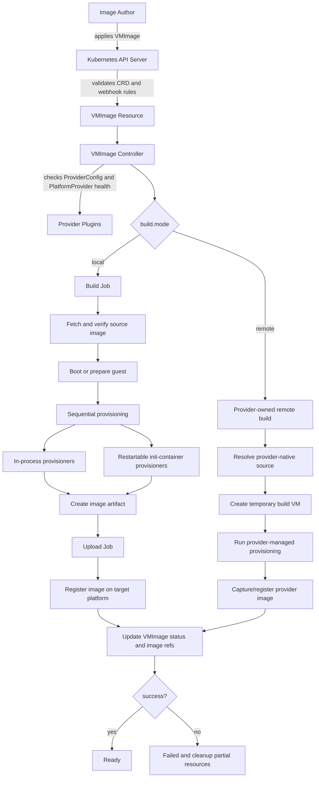
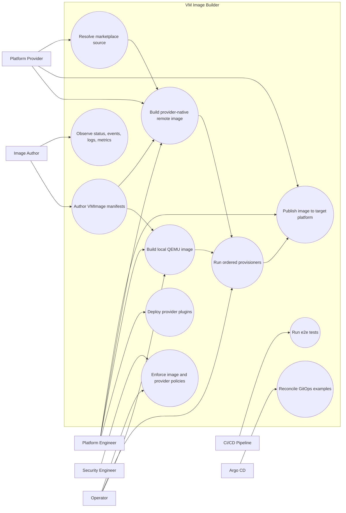

# Architecture Diagrams — VM Image Builder

## Build Workflow

```mermaid
flowchart TD
    author[Image Author] -->|applies VMImage| api[Kubernetes API Server]
    api -->|validates CRD and webhook rules| vmimage[VMImage Resource]
    vmimage --> controller[VMImage Controller]

    controller -->|checks ProviderConfig and PlatformProvider health| providers[Provider Plugins]
    controller --> mode{build.mode}

    mode -->|local| buildJob[Build Job]
    buildJob --> source[Fetch and verify source image]
    source --> boot[Boot or prepare guest]
    boot --> provision[Sequential provisioning]
    provision --> inproc[In-process provisioners]
    provision --> init[Restartable init-container provisioners]
    inproc --> artifact[Create image artifact]
    init --> artifact
    artifact --> uploadJob[Upload Job]

    mode -->|remote| remoteProvider[Provider-owned remote build]
    remoteProvider --> remoteSource[Resolve provider-native source]
    remoteSource --> remoteVM[Create temporary build VM]
    remoteVM --> remoteProvision[Run provider-managed provisioning]
    remoteProvision --> remoteImage[Capture/register provider image]

    uploadJob --> register[Register image on target platform]
    register --> status[Update VMImage status and image refs]
    remoteImage --> status

    status --> ready{success?}
    ready -->|yes| done[Ready]
    ready -->|no| failed[Failed and cleanup partial resources]
```

## Use Cases

```mermaid
flowchart LR
    author[Image Author]
    platform[Platform Engineer]
    security[Security Engineer]
    operator[Operator]
    provider[Platform Provider]
    ci[CI/CD Pipeline]
    argocd[Argo CD]

    subgraph system[VM Image Builder]
        uc1((Author VMImage manifests))
        uc2((Build local QEMU image))
        uc3((Build provider-native remote image))
        uc4((Run ordered provisioners))
        uc5((Publish image to target platform))
        uc6((Resolve marketplace source))
        uc7((Enforce image and provider policies))
        uc8((Observe status, events, logs, metrics))
        uc9((Deploy provider plugins))
        uc10((Reconcile GitOps examples))
        uc11((Run e2e tests))
    end

    author --> uc1
    author --> uc8
    platform --> uc9
    platform --> uc2
    platform --> uc3
    platform --> uc5
    security --> uc7
    ci --> uc11
    argocd --> uc10

    operator --> uc2
    operator --> uc4
    operator --> uc7
    provider --> uc3
    provider --> uc5
    provider --> uc6

    uc1 --> uc2
    uc1 --> uc3
    uc2 --> uc4
    uc3 --> uc4
    uc4 --> uc5
    uc6 --> uc3
```
